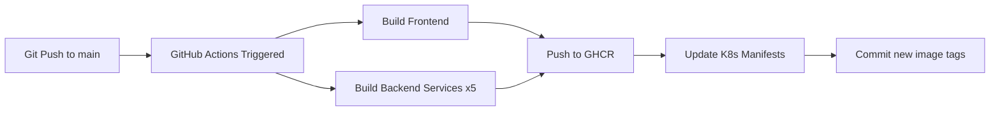
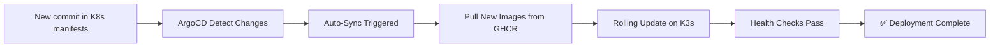

# 🚀 CI/CD මාර්ගෝපදේශය — Campus RSO Platform

## 📌 සාරාංශය

මෙම මාර්ගෝපදේශය ඔබට DigitalOcean server එකක GitHub Actions + ArgoCD CI/CD pipeline එකක් setup කරන ආකාරය පියවරෙන් පියවර පෙන්වයි.

### CI/CD Architecture

```
GitHub Push → GitHub Actions (CI) → Docker Images → GHCR
                                                      ↓
                                              ArgoCD (CD) ← K8s Manifests
                                                      ↓
                                            DigitalOcean Server (K3s)
                                                      ↓
                                            Cloudflare → pro.isuruhub.site
```

---

## 📋 අවශ්‍ය දේවල්

- DigitalOcean Server (IP: `168.144.45.214`)
- GitHub Repository: `https://github.com/isuru709/RSO`
- Cloudflare account (domain: `pro.isuruhub.site`)
- SSH access to server
- Local machine එකේ SSH client

---

## 🖥️ පියවර 1: DigitalOcean Server එකට SSH වීම

```bash
# ඔබේ local machine එකෙන්
ssh root@168.144.45.214
```

> [!NOTE]
> පළමු වරට connect කරන විට fingerprint confirm කරන්න (`yes` type කරන්න).

---

## 📦 පියවර 2: Server එක Update කිරීම

```bash
# System update
apt update && apt upgrade -y

# අවශ්‍ය tools install කිරීම
apt install -y curl wget git apt-transport-https ca-certificates software-properties-common
```

---

## ⚙️ පියවර 3: K3s (Lightweight Kubernetes) Install කිරීම

K3s යනු production-ready lightweight Kubernetes distribution එකකි. Single-node server එකකට perfect.

```bash
# K3s install කිරීම
curl -sfL https://get.k3s.io | sh -

# K3s හරියට run වෙනවද බලන්න
systemctl status k3s

# kubectl access ලැබෙනවද බලන්න
kubectl get nodes
```

Output එක මෙවැනි ලෙස පෙන්විය යුතුය:
```
NAME              STATUS   ROLES                  AGE   VERSION
your-server       Ready    control-plane,master   1m    v1.31.x+k3s1
```

### Kubeconfig setup:

```bash
# kubeconfig file එක copy කිරීම (local machine එකෙන් access කිරීමට)
mkdir -p ~/.kube
cp /etc/rancher/k3s/k3s.yaml ~/.kube/config

# Environment variable set කිරීම
export KUBECONFIG=/etc/rancher/k3s/k3s.yaml
echo 'export KUBECONFIG=/etc/rancher/k3s/k3s.yaml' >> ~/.bashrc
```

---

## 🔧 පියවර 4: ArgoCD Install කිරීම

### 4.1 ArgoCD Namespace සහ Install

```bash
# ArgoCD namespace create කිරීම
kubectl create namespace argocd

# ArgoCD install කිරීම
kubectl apply -n argocd -f https://raw.githubusercontent.com/argoproj/argo-cd/stable/manifests/install.yaml

# Pods සියල්ල ready වෙනතුරු බලා සිටින්න (2-3 minutes)
kubectl wait --for=condition=ready pod -l app.kubernetes.io/part-of=argocd -n argocd --timeout=300s
```

### 4.2 ArgoCD Server External Access

```bash
# ArgoCD Server service එක NodePort ලෙස expose කිරීම
kubectl patch svc argocd-server -n argocd -p '{"spec": {"type": "NodePort", "ports": [{"port": 443, "targetPort": 8080, "nodePort": 30443, "protocol": "TCP", "name": "https"}]}}'
```

> [!WARNING]
> Production එකේදී ArgoCD port 30443 ලෙස expose වේ.
> Access: `https://168.144.45.214:30443`

### 4.3 ArgoCD Admin Password ලබා ගැනීම

```bash
# Initial admin password ලබා ගැනීම
kubectl -n argocd get secret argocd-initial-admin-secret -o jsonpath="{.data.password}" | base64 -d && echo
```

> [!IMPORTANT]
> **Username:** `admin`
> **Password:** ඉහත command එකෙන් ලැබෙන password එක use කරන්න.
> පළමු login එකෙන් පසු password change කරන්න!

### 4.4 ArgoCD CLI Install (Optional)

```bash
# ArgoCD CLI install (server එකේ)
curl -sSL -o argocd https://github.com/argoproj/argo-cd/releases/latest/download/argocd-linux-amd64
install -m 555 argocd /usr/local/bin/argocd
rm argocd

# ArgoCD login
argocd login 168.144.45.214:30443 --insecure --username admin --password <ඔබේ_password>

# Password change
argocd account update-password
```

---

## 🔐 පියවර 5: Kubernetes Secrets Create කිරීම

### 5.1 RSO Namespace Create

```bash
kubectl create namespace rso
```

### 5.2 Application Secrets

```bash
# Environment variable secrets create කිරීම
kubectl create secret generic rso-secrets -n rso \
  --from-literal=SUPABASE_URL='https://jpdotxyhemgkwlnlyhpz.supabase.co' \
  --from-literal=SUPABASE_SERVICE_ROLE_KEY='<ඔබේ_supabase_key>' \
  --from-literal=FIREBASE_API_KEY='<ඔබේ_firebase_api_key>' \
  --from-literal=RESEND_API_KEY='<ඔබේ_resend_api_key>' \
  --from-literal=NOTIFICATION_FROM_EMAIL='onboarding@resend.dev' \
  --from-literal=EMAIL_PROVIDER='resend'
```

> [!CAUTION]
> ⚠️ **Secret values මෙහි ඇති ඒවා example වශයෙන් පමණි!**
> ඔබේ `.env` file එකේ ඇති actual values use කරන්න.

### 5.3 Firebase Service Account Secret

```bash
# Firebase service account JSON file එක secret ලෙස create කිරීම
kubectl create secret generic firebase-service-account -n rso \
  --from-file=firebase-service-account.json=./firebase-service-account.json
```

> [!NOTE]
> `firebase-service-account.json` file එක ඔබේ local machine එකෙන් server එකට SCP මගින් upload කරන්න:
> ```bash
> scp ./backend/config/firebase-service-account.json root@168.144.45.214:~/firebase-service-account.json
> ```

### 5.4 SSL Origin Certificates Secret

```bash
# Cloudflare Origin Certificate secret create කිරීම
kubectl create secret generic ssl-origin-certs -n rso \
  --from-file=origin.pem=./origin.pem \
  --from-file=origin-key.pem=./origin-key.pem
```

> [!NOTE]
> SSL certificates ද SCP මගින් server එකට upload කරන්න:
> ```bash
> scp ./backend/infra/gateway/ssl/origin.pem root@168.144.45.214:~/origin.pem
> scp ./backend/infra/gateway/ssl/origin-key.pem root@168.144.45.214:~/origin-key.pem
> ```

### 5.5 Gateway Nginx ConfigMap

```bash
# Nginx config file එක ConfigMap ලෙස create කිරීම
kubectl create configmap gateway-nginx-conf -n rso \
  --from-file=nginx.conf=./nginx.conf
```

> [!NOTE]
> Nginx config file එක ද server එකට upload කරන්න:
> ```bash
> scp ./backend/infra/gateway/nginx.conf root@168.144.45.214:~/nginx.conf
> ```

---

## 🔑 පියවර 6: GitHub Container Registry (GHCR) Access

K3s cluster එකට GHCR එකෙන් private images pull කිරීමට authentication අවශ්‍යයි.

### 6.1 GitHub Personal Access Token (PAT) Create කිරීම

1. GitHub → **Settings** → **Developer Settings** → **Personal Access Tokens** → **Tokens (classic)**
2. **Generate new token (classic)** click කරන්න
3. Scopes select කරන්න:
   - ✅ `read:packages`
   - ✅ `write:packages`
4. Token එක copy කරන්න

### 6.2 K3s Registry Auth Config

```bash
# K3s registries config create කිරීම
cat > /etc/rancher/k3s/registries.yaml << 'EOF'
mirrors:
  ghcr.io:
    endpoint:
      - "https://ghcr.io"
configs:
  "ghcr.io":
    auth:
      username: isuru709
      password: <ඔබේ_GITHUB_PAT>
EOF

# K3s restart කරන්න
systemctl restart k3s
```

### 6.3 Image Pull Secret (Kubernetes)

```bash
kubectl create secret docker-registry ghcr-secret -n rso \
  --docker-server=ghcr.io \
  --docker-username=isuru709 \
  --docker-password=<ඔබේ_GITHUB_PAT> \
  --docker-email=<ඔබේ_email>
```

---

## 🚀 පියවර 7: ArgoCD Application Deploy කිරීම

### 7.1 Application YAML Apply

```bash
# ArgoCD Application resource apply කිරීම
kubectl apply -f k8s/argocd/application.yaml
```

> [!NOTE]
> මෙම file එක repo එකේ `k8s/argocd/application.yaml` ලෙස ඇත.
> ඔබ repo එක server එකට clone කර ඇත්නම් direct apply කරන්න.
> නැතහොත් file එක SCP මගින් upload කරන්න:
> ```bash
> scp ./k8s/argocd/application.yaml root@168.144.45.214:~/application.yaml
> kubectl apply -f ~/application.yaml
> ```

### 7.2 ArgoCD Dashboard එකේ Verify කිරීම

1. Browser එකෙන් `https://168.144.45.214:30443` open කරන්න
2. Admin credentials වලින් login කරන්න
3. `rso-platform` application එක දැකිය යුතුය
4. Status: **Synced** ✅ සහ **Healthy** 💚 ලෙස පෙන්විය යුතුය

---

## 📝 පියවර 8: GitHub Actions Secrets Setup

GitHub repo settings එකේ CI pipeline එකට අවශ්‍ය secrets add කරන්න.

1. GitHub → `isuru709/RSO` → **Settings** → **Secrets and variables** → **Actions**
2. **New repository secret** click කරන්න
3. මෙම secrets add කරන්න:

| Secret Name | Description |
|---|---|
| `GHCR_TOKEN` | GitHub PAT (packages access) — `GITHUB_TOKEN` auto-provided වේ, අමතර secret අවශ්‍ය නැත |

> [!TIP]
> GitHub Actions තුළ `GITHUB_TOKEN` automatically available වේ GHCR access සඳහා.
> අමතර PAT එකක් add කිරීම අවශ්‍ය නැත!

---

## 🔄 පියවර 9: CI/CD Pipeline ක්‍රියාත්මක වන ආකාරය

### CI (Continuous Integration) — GitHub Actions



**ක්‍රියාවලිය:**
1. `main` branch එකට code push කරන විට GitHub Actions trigger වේ
2. Frontend Dockerfile build කර GHCR එකට push කරයි
3. Backend services 5ම (matrix strategy) parallel build කර GHCR push කරයි
4. `k8s/overlays/production/kustomization.yaml` file එකේ image tags update කරයි
5. Updated manifest commit කර push කරයි

### CD (Continuous Deployment) — ArgoCD



**ක්‍රියාවලිය:**
1. ArgoCD හි Git repo monitor කරයි (3 min interval)
2. `kustomization.yaml` එකේ image tag changes detect කරයි
3. Auto-sync enable නිසා automatic deployment trigger වේ
4. K3s cluster එකේ rolling update සිදු වේ
5. Health checks pass වූ පසු deployment complete!

---

## 🧪 පියවර 10: Testing & Verification

### Pipeline Test කිරීම

```bash
# Local machine එකෙන් code change එකක් push කරන්න
git add .
git commit -m "test: CI/CD pipeline verification"
git push origin main
```

### Verify Steps:

1. **GitHub Actions Tab** → workflow run check කරන්න
2. **GHCR** → `ghcr.io/isuru709/rso-*` images build වෙලා ද බලන්න
3. **ArgoCD Dashboard** → sync status check කරන්න
4. **kubectl** → pods running ද check කරන්න:

```bash
# Server එකේ
kubectl get pods -n rso
kubectl get svc -n rso
```

---

## 🛠️ Troubleshooting

### Issue: ArgoCD Sync Failed

```bash
# ArgoCD app status check
argocd app get rso-platform

# Manual sync
argocd app sync rso-platform

# Events check
kubectl get events -n rso --sort-by='.lastTimestamp'
```

### Issue: Pods CrashLoopBackOff

```bash
# Pod logs check
kubectl logs -n rso deployment/tenant-service --tail=50

# Pod describe (events බලන්න)
kubectl describe pod -n rso -l app=tenant-service
```

### Issue: Image Pull Error

```bash
# GHCR secret verify
kubectl get secret ghcr-secret -n rso

# K3s registry config verify
cat /etc/rancher/k3s/registries.yaml

# K3s restart
systemctl restart k3s
```

### Issue: GitHub Actions Failed

1. GitHub → Actions tab → failed workflow click
2. Log output carefully read කරන්න
3. Secrets correctly set ද verify කරන්න

---

## 📊 Useful Commands

```bash
# ====== Kubernetes ======
kubectl get pods -n rso                    # සියලු pods බලන්න
kubectl get svc -n rso                     # Services බලන්න
kubectl logs -f -n rso deploy/gateway      # Gateway logs
kubectl rollout restart -n rso deploy/booking-service  # Service restart

# ====== ArgoCD ======
argocd app list                            # Applications list
argocd app sync rso-platform               # Manual sync
argocd app history rso-platform            # Deployment history

# ====== K3s ======
systemctl status k3s                       # K3s status
kubectl top nodes                          # Node resource usage
kubectl top pods -n rso                    # Pod resource usage
```

---

## ✅ Setup Checklist

- [ ] Server SSH access එක ක්‍රියාත්මකයි
- [ ] K3s install කර ඇත
- [ ] ArgoCD install කර login කළ හැකිය
- [ ] `rso` namespace create කර ඇත
- [ ] `rso-secrets` secret create කර ඇත
- [ ] `firebase-service-account` secret create කර ඇත
- [ ] `ssl-origin-certs` secret create කර ඇත
- [ ] `gateway-nginx-conf` ConfigMap create කර ඇත
- [ ] GHCR registry auth configure කර ඇත
- [ ] ArgoCD Application deploy කර ඇත
- [ ] GitHub Actions workflow push කර ඇත
- [ ] First pipeline run success ✅
